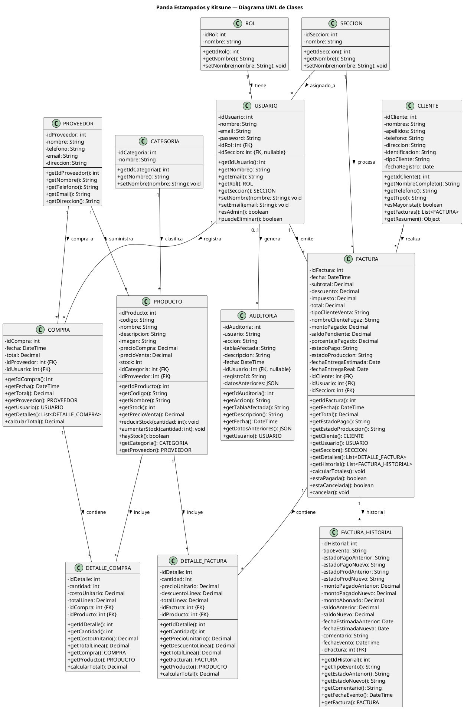

# Diagrama UML de Clases — Panda Estampados y Kitsune

> **Herramienta recomendada:** [PlantUML Online](https://www.plantuml.com/plantuml)
> **Alternativa:** [draw.io](https://app.diagrams.net) → Nuevo diagrama → "UML Class"

---

## Cómo generarlo

### Opción 1: PlantUML (automático)

1. Copiá el código de abajo
2. Pegalo en [www.plantuml.com/plantuml](https://www.plantuml.com/plantuml)
3. Se genera el diagrama automáticamente
4. Click derecho → "Save as" para exportar PNG/SVG

### Opción 2: draw.io (manual)

1. Abrí [app.diagrams.net](https://app.diagrams.net)
2. Nuevo diagrama → "UML Class"
3. Creá clases con atributos y métodos
4. Conectá con asociaciones (líneas)

---

## Código PlantUML — Copiar y Pegar

---

## Relaciones UML (multiplicidad)

| Clase 1   | Multiplicidad | Relación   | Multiplicidad | Clase 2           |
| --------- | :-----------: | ---------- | :-----------: | ----------------- |
| ROL       |       1       | tiene      |       *       | USUARIO           |
| SECCION   |       1       | asignado_a |       *       | USUARIO           |
| CATEGORIA |       1       | clasifica  |       *       | PRODUCTO          |
| PROVEEDOR |       1       | suministra |       *       | PRODUCTO          |
| PROVEEDOR |       1       | compra_a   |       *       | COMPRA            |
| USUARIO   |       1       | registra   |       *       | COMPRA            |
| USUARIO   |       1       | emite      |       *       | FACTURA           |
| SECCION   |       1       | procesa    |       *       | FACTURA           |
| CLIENTE   |       1       | realiza    |       *       | FACTURA           |
| COMPRA    |       1       | contiene   |       *       | DETALLE_COMPRA    |
| PRODUCTO  |       1       | incluye    |       *       | DETALLE_COMPRA    |
| FACTURA   |       1       | contiene   |       *       | DETALLE_FACTURA   |
| PRODUCTO  |       1       | incluye    |       *       | DETALLE_FACTURA   |
| FACTURA   |       1       | historial  |       *       | FACTURA_HISTORIAL |
| USUARIO   |     0..1      | genera     |       *       | AUDITORIA         |
